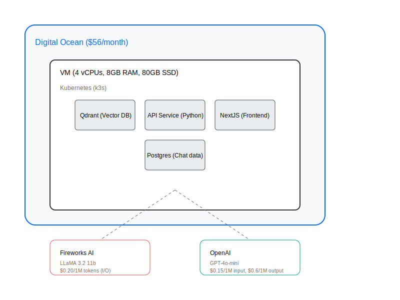

# UNESP (PPGCC) Chatbot 🚀

## Project Overview 🎓

Welcome! This is a chatbot project developed as part of the Deep Learning course in the [Postgraduate Program in Computer Science (PPGCC) at UNESP](https://www.ibilce.unesp.br/#!/pos-graduacao/programas-de-pos-graduacao/ciencia-da-computacao/apresentacao/)! 🤖💬

This chatbot uses context-based learning with RAG (Retrieval-Augmented Generation) to answer questions about the PPGCC program. We use data from the PPGCC website to create an intelligent and responsive assistant for program-related queries.

The system employs a hybrid search approach, combining semantic search using the [BAAI/bge-m3](https://huggingface.co/BAAI/bge-m3) embeddings model with BM25. After searches, we use [RRF (Reciprocal Rank Fusion)](https://plg.uwaterloo.ca/~gvcormac/cormacksigir09-rrf.pdf) to combine the results 🔍🧠

## Course: Deep Learning

### Professor
**Prof. Denis Henrique Pinheiro Salvadeo**
- [Lattes](http://lattes.cnpq.br/1475921082905793)
- [LinkedIn](https://www.linkedin.com/in/denis-salvadeo-4022b88/)

## Project Team 👥

### André da Fonseca Schuck
- [Lattes](http://lattes.cnpq.br/3687175861120007)
- [LinkedIn](https://www.linkedin.com/in/andre-schuck)
- Advisor: Prof. João Paulo Papa ([Lattes](http://lattes.cnpq.br/9039182932747194) | [LinkedIn](https://www.linkedin.com/in/jo%C3%A3o-paulo-papa-1a827923/))

### Gabriel de Souza Lima
- [Lattes](http://lattes.cnpq.br/2789715683983963)
- [LinkedIn](https://www.linkedin.com/in/gabriel-lima-b3976b192)
- Advisor: Prof. Veronica Oliveira de Carvalho ([Lattes](http://lattes.cnpq.br/1961581092362881))

### Wagner Costa Santos
- [Lattes](http://lattes.cnpq.br/8724697279191424)
- [LinkedIn](https://www.linkedin.com/in/wagnercostasantos)
- Advisor: Prof. Arnaldo Candido Junior ([Lattes](http://lattes.cnpq.br/8769928331729891))

## Technologies Used 💻

- **[Qdrant](https://qdrant.tech/)**: Vector search engine for efficient similar information retrieval.
- **[Next.js](https://nextjs.org/)**: React framework for building modern and optimized web applications.
- **[AI SDK (Vercel)](https://sdk.vercel.ai/)**: Development kit for AI integration in web applications.
- **[Llama 3.2 11B](https://ai.meta.com/llama/)**: Open Source language model used for experiments.
- **[GPT-4o mini](https://openai.com/index/gpt-4o-mini-advancing-cost-efficient-intelligence/)**: OpenAI language model used in the chatbot.
- **[BAAI/bge-m3](https://huggingface.co/BAAI/bge-m3)**: Embeddings model for advanced semantic search.


## Getting Started

The search engine is based on the [Qdrant](https://qdrant.com/) vector database.
For details on how to scrape the data, see the [scraping](01-scraper/README.MD) directory.

### Prerequisites

- Python 3.11 or later

### Installation

Install venv:

```bash
python3.11 -m venv .venv
```

Activate venv:

```bash
# Linux
source .venv/bin/activate

# Windows
.venv\Scripts\activate
```

Install dependencies:

```bash
pip install -r requirements.txt
```

Note: If you want to run the scraper, you need to install the dependencies in the `01-scraper\requirements.txt` file.

### Scraping

See the [scraping](01-scraper/README.MD) directory.

### Global environment variables

Create a `.env` file in the root directory with the following variables:

```bash
QDRANT_URL=http://localhost:6333
QDRANT_API_KEY=someapikey
ROOT_PROJECT_FOLDER=/home/someuser/unesp-chatbot # The root folder of the project
QDRANT_COLLECTION_NAME=UNESP_CHATBOT_PPGCC
```

### Preprocessing

```bash
python 03-preprocess-create-chunks/01-create-metadata.py
```

This script will create a metadata file:

```bash
02-preprocessed-data/content_metadata.json
```

### Chunking content

- To create the chunks we are also using 2 external files from other projects:

```bash
02-preprocessed-data/utils/page_titles.json
02-preprocessed-data/utils/remove-list.json
```

We are using the page_titles.json file to get the titles of the pages (LLM generated). The remove-list.json file is used to ignore some pages that are not relevant to the chatbot (empty pages or pages with only links). We are also removing other pages with old information.

- Preprocess the data and create the chunks:

```bash
python 03-preprocess-create-chunks/02-create-chunks.py
```

Result:

```bash
02-preprocessed-data/01-chunks_data.json
02-preprocessed-data/chunks_stats.json # Stats about the chunks
``` 

### Upload to vector database (Qdrant)

- Using Qdrant locally:

```bash
docker-compose up -d
```

- Upload the data to Qdrant:

```bash
python 04-load-vector-db/main.py
```

We are using `"BAAI/bge-m3"` model to generate the embeddings and we also using BM25 (`"Qdrant/bm25"`) to generate the scores.

### API

The API is a FastAPI application that uses the Qdrant database to search for answers (`05-search-api`).

To run the API:

```bash
python 05-search-api/service.py
```

You can access the API at `http://localhost:8055/docs`.

### Chatbot

The chatbot is a Next.js application that uses the AI SDK to interact with the API (`06-chatbot`).

Environment variables:

Create a `.env.local` file in the `06-chatbot` directory with the following variables:

```bash
# Get your OpenAI API Key here: https://platform.openai.com/account/api-keys
OPENAI_API_KEY=************
FIREWORKS_API_KEY=************

API_SEARCH_SERVER=************
AUTH_TRUST_HOST=true

# Generate a random secret: https://generate-secret.vercel.app/32 or `openssl rand -base64 32`
AUTH_SECRET=************

POSTGRES_URL=************

AUTH_GOOGLE_ID=************
AUTH_GOOGLE_SECRET=************
```

Install dependencies:

```bash
pnpm install
```

Run the chatbot:

```bash
pnpm dev
```

## Infrastructure

### Diagram (Pricing in USD - 2024 November)



### Monthly Costs

- Digital Ocean droplet: $56.00 (R$336.00)
  
**Important**: The costs are based on the current prices and the usage of a small number of users. The costs can change according to the usage and the number of users.

### Cost per query

- Estimated tokens per query (average): Input: 1700 tokens, Output: 300 tokens

1. **GPT-4o-mini**
   - Cost (input token): $0.15/1000000 = $0.00000015 * 1700 = $0.000255
   - Cost (output token): $0.60/1000000 = $0.0000006 * 300 = $0.00018
   - Total cost: $0.000435
   - Total cost (BRL): $0.000435 * 6 = R$0.00261

2. **Fireworks - LLaMA 3.2 11b**
   - Cost (input token): $0.2/1000000 = $0.0000002 * 1700 = $0.00034
   - Cost (output token): $0.2/1000000 = $0.0000002 * 300 = $0.00006
   - Total cost: $0.0004
   - Total cost (BRL): $0.0004 * 6 = R$0.0024

### Cost Summary

| Service | Cost | Cost (BRL) | Cost Type |
| --- | --- | --- | --- |
| GPT-4o-mini | $0.000435 | R$0.00261 | Per query |
| Fireworks - LLaMA 3.2 11b | $0.0004 | R$0.0024 | Per query |
| Digital Ocean droplet | $56.00 | R$336.00 | Monthly |

### Embeddings

The embeddings run on the Qdrant server locally using CPU. The embeddings are generated using the `"BAAI/bge-m3"` model. The Qdrant server also handles the BM25 scoring.